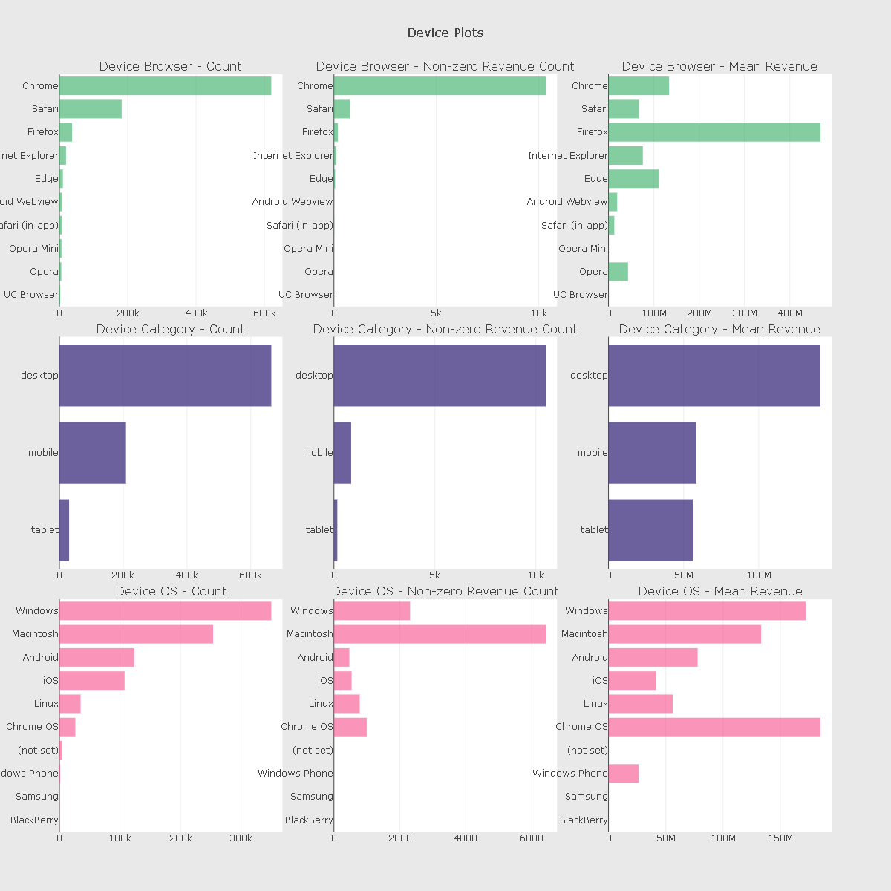
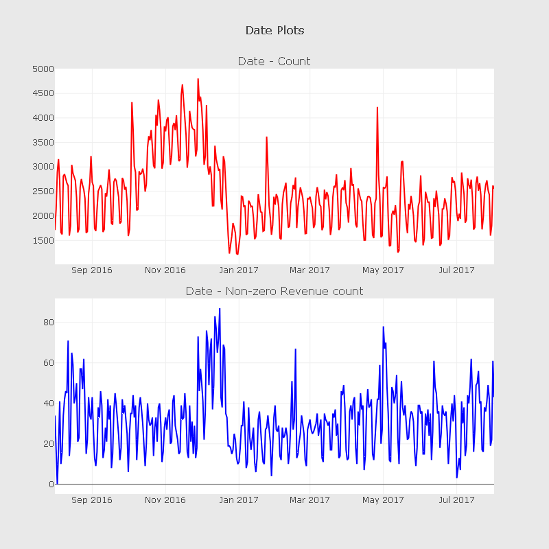
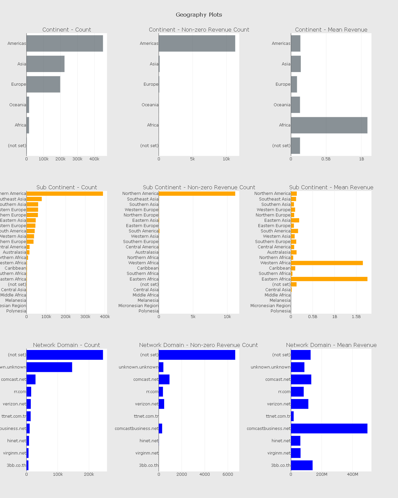
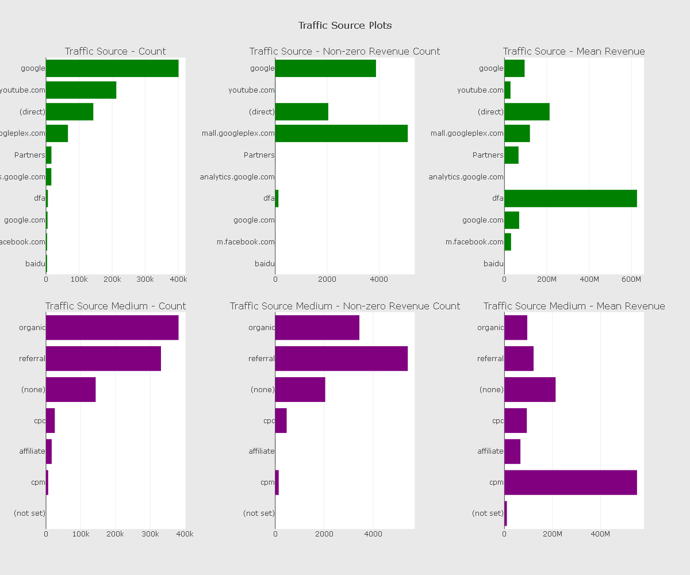
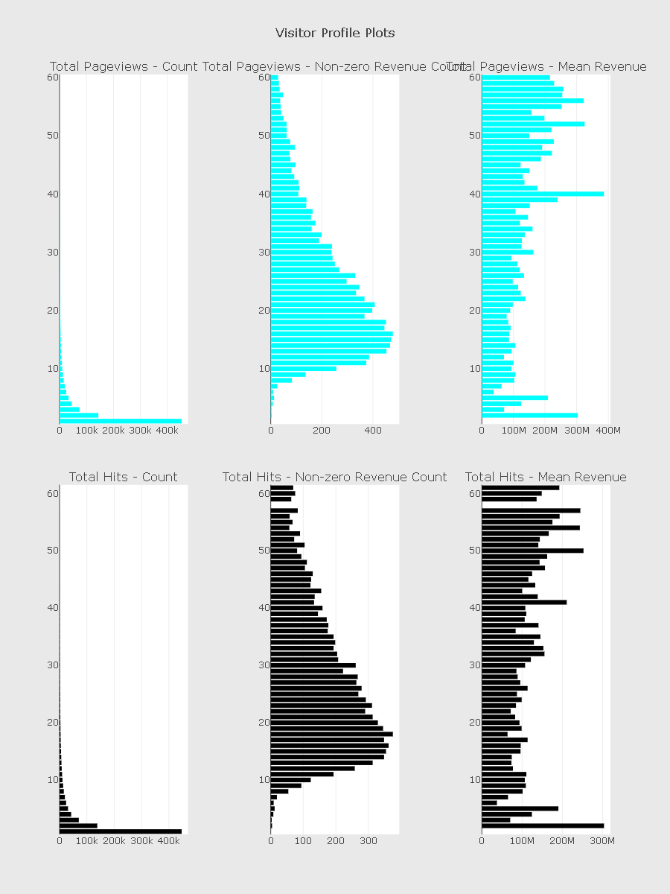
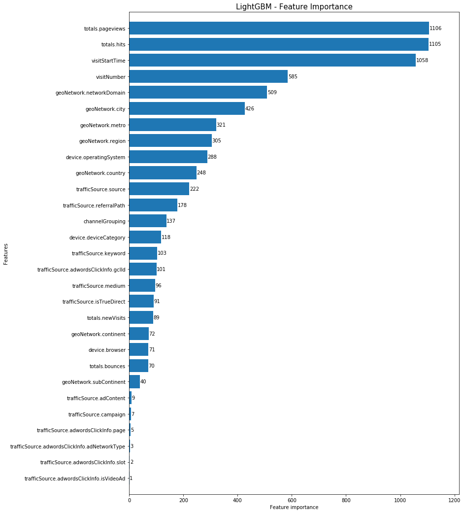

## Customer Revinue Prediction

# Objective:
Analyze a Google Merchandise Store (also known as GStore, where Google swag is sold) customer dataset to predict revenue per customer

# About the dataset
The data fields in the given files are

- fullVisitorId- A unique identifier for each user of the Google Merchandise Store.
- channelGrouping - The channel via which the user came to the Store.
- date - The date on which the user visited the Store.
- device - The specifications for the device used to access the Store.
- geoNetwork - This section contains information about the geography of the user.
- sessionId - A unique identifier for this visit to the store.
- socialEngagementType - Engagement type, either "Socially Engaged" or "Not Socially Engaged".
- totals - This section contains aggregate values across the session.
- trafficSource - This section contains information about the Traffic Source from which the session originated.
- visitId - An identifier for this session. This is part of the value usually stored as the _utmb cookie. This is only unique to the - user. For a completely unique ID, you should use a combination of fullVisitorId and visitId.
- visitNumber - The session number for this user. If this is the first session, then this is set to 1.
- visitStartTime - The timestamp (expressed as POSIX time).

# Some Inquires:

# Q1 Number of visitors and common visitors?
Number of unique visitors in train set :  714167  out of rows :  903653
Number of unique visitors in test set :  617242  out of rows :  804684
Number of common visitors in train and test set :  7679

# Q2 Columns with constant values?
 ['socialEngagementType',
 'device.browserSize',
 'device.browserVersion',
 'device.flashVersion',
 'device.language',
 'device.mobileDeviceBranding',
 'device.mobileDeviceInfo',
 'device.mobileDeviceMarketingName',
 'device.mobileDeviceModel',
 'device.mobileInputSelector',
 'device.operatingSystemVersion',
 'device.screenColors',
 'device.screenResolution',
 'geoNetwork.cityId',
 'geoNetwork.latitude',
 'geoNetwork.longitude',
 'geoNetwork.networkLocation',
 'totals.visits',
 'trafficSource.adwordsClickInfo.criteriaParameters']

 # Q3 Device Information?

Inferences:
- Device browser distribution looks similar on both the count and count of non-zero revenue plots
- On the device category front, desktop seem to have higher percentage of non-zero revenue counts compared to mobile devices.
- In device operating system, though the number of counts is more from windows, the number of counts where revenue is not zero is   more for Macintosh.
- Chrome OS also has higher percentage of non-zero revenue counts
- On the mobile OS side, iOS has more percentage of non-zero revenue counts compared to Android

# Q4 Date Exploration

Inferences:

- We have data from 1 Aug, 2016 to 31 July, 2017 in our training dataset
- In Nov 2016, though there is an increase in the count of visitors, there is no increase in non-zero revenue counts during that time period (relative to the mean).

# Q5 Geographic Information

Inferences:

- On the continent plot, we can see that America has both higher number of counts as well as highest number of counts where the revenue is non-zero
- Though Asia and Europe has high number of counts, the number of non-zero revenue counts from these continents are comparatively low.
- We can infer the first two points from the sub-continents plot too.
If the network domain is "unknown.unknown" rather than "(not set)", then the number of counts with non-zero revenue tend to be lower.

# Q6 Traffic Source

Inferences:

- In the traffic source plot, though Youtube has high number of counts in the dataset, the number of non-zero revenue counts are very less.
- Google plex has a high ratio of non-zero revenue count to total count in the traffic source plot.
On the traffic source medium, "referral" has more number of non-zero revenue count compared to "organic" medium.

# Q7 Profile of Visitor

Inferences:

- Both these variables look very predictive
- Count plot shows decreasing nature i.e. we have a very high total count for less number of hits and page views per visitor transaction and the overall count decreases when the number of hits per visitor transaction increases.
- On the other hand, we can clearly see that when the number of hits / pageviews per visitor transaction increases, we see that there is a high number of non-zero revenue counts.

# Q8 Feature importance of the model

